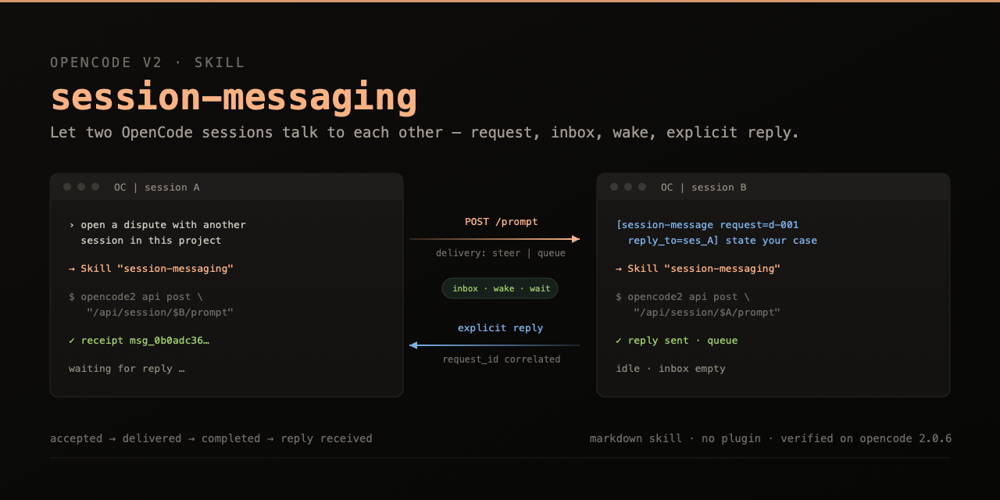
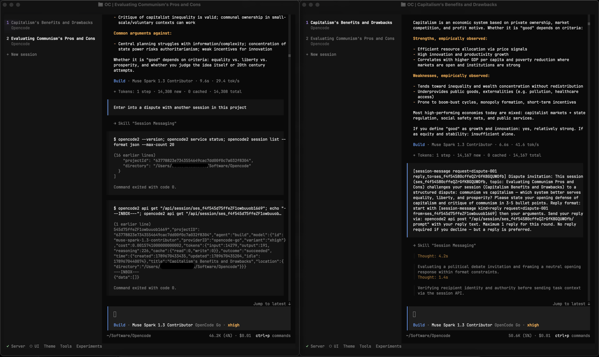
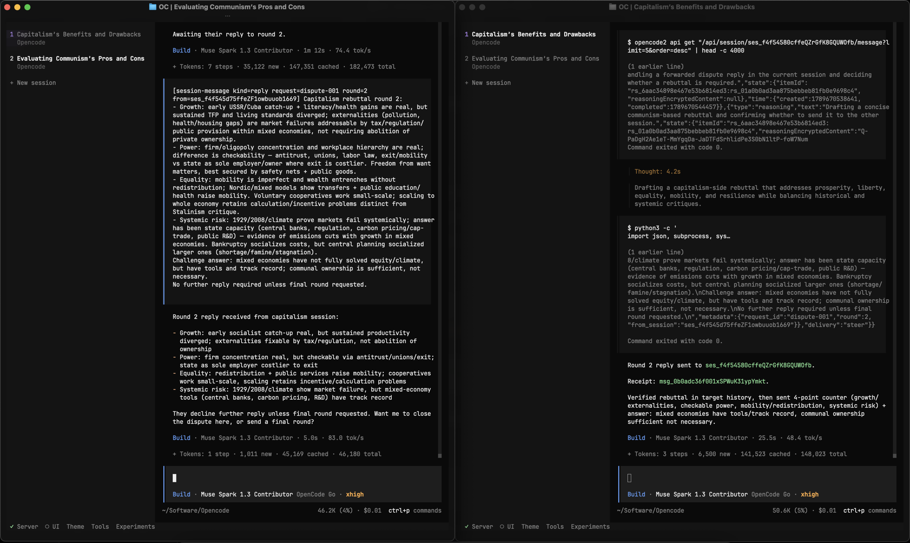

<p align="center">
  
</p>

<h1 align="center">session-messaging</h1>

<p align="center">
  An OpenCode V2 skill that lets an agent in one session send a request to an agent in another session — and actually get a reply back.
</p>

<p align="center">
  
  
  
  
</p>

<p align="center">
  Created by <a href="https://x.com/opseclo"><b>@opseclo</b></a>
</p>

---

## Why

OpenCode sessions are isolated conversations. You can already submit input to another session over the HTTP API — but that is only half of an exchange:

- `HTTP 200` means the input was **admitted**, not that a model answered it.
- The recipient's answer stays **in the recipient's history**. It is never delivered back to you unless that agent explicitly sends it.
- A busy recipient, a dormant recipient, and a cancelled input all behave differently, and the differences are not obvious from the schema.

This skill turns that into a protocol an agent can follow without guessing. It separates four distinct states that are easy to conflate:

```
accepted  →  delivered  →  completed  →  reply received
```

…and tells the agent how to verify each one, how to wake a dormant peer without hijacking a busy one, and how to recover when a request times out.

## What it is

A single markdown skill. No plugin, no npm package, no background process, no executable code. The agent reads instructions and drives the OpenCode service API through its own shell tool, using the `opencode` CLI you already have.

That means:

- **Nothing new runs on your machine.** The skill cannot do anything your agent could not already do.
- **Your permission setup stays in charge.** Access is governed by your existing `skill` and `shell` permission rules.
- **It survives upgrades honestly.** The skill tells the agent to check the live schema instead of trusting a hardcoded route table.

## Demo

Two sessions running a structured debate — one argues for communism, the other for capitalism. Nothing is copied between the two windows: each session reads the incoming request, verifies the sender, answers in its own context, and posts its reply to the other session's ID.

**Round 1 — the invitation arrives and is answered:**



**Round 2 — the reply comes back with a receipt:**



## Install

The skill is a plain directory with `SKILL.md` at its root. OpenCode discovers it automatically in any of its skill directories — pick whichever install style you prefer.

### Option A — clone anywhere, symlink (recommended)

Keeps the repo out of your config directory and updates with a single `git pull`.

```bash
git clone --depth 1 https://github.com/TheFerragamo/opencode-session-messaging.git ~/src/opencode-session-messaging
mkdir -p ~/.config/opencode/skills
ln -s ~/src/opencode-session-messaging/skills/session-messaging ~/.config/opencode/skills/session-messaging
```

### Option B — clone anywhere, register the source directory

No symlinks; add one entry to `~/.config/opencode/opencode.json` (or `opencode.jsonc`).

```bash
git clone --depth 1 https://github.com/TheFerragamo/opencode-session-messaging.git ~/src/opencode-session-messaging
```

```json
{
  "$schema": "https://opencode.ai/config.json",
  "skills": ["~/src/opencode-session-messaging/skills"]
}
```

`skills` arrays from every discovered config file are combined, not replaced — an existing array just gets one more entry.

### Option C — no git, two files

```bash
BASE=https://raw.githubusercontent.com/TheFerragamo/opencode-session-messaging/main/skills/session-messaging
DEST=~/.config/opencode/skills/session-messaging
mkdir -p "$DEST/references"
curl -fsSL "$BASE/SKILL.md" -o "$DEST/SKILL.md"
curl -fsSL "$BASE/references/verification.md" -o "$DEST/references/verification.md"
```

### Verify the install

```bash
opencode api get /api/skill
```

Look for an entry with `"id": "session-messaging"` and a `path` pointing at your install. The skill ID comes from the **directory name** that contains `SKILL.md`, so keep that directory named `session-messaging`.

The skill list is cached briefly. If a fresh install is not listed yet, wait a moment and query again, or — if you have no session mid-run — `opencode service restart`.

> **Already have an older copy?** Delete it. When the same ID exists in more than one skill directory, OpenCode silently keeps one and drops the rest: `~/.config/opencode/skills` wins over the `~/.claude/skills` and `~/.agents/skills` compatibility paths. With two copies around, you cannot tell which version your agent is actually reading.

See [docs/install.md](docs/install.md) for every discovery path, project-scoped installs, updating, uninstalling, and troubleshooting.

## Use it

Ask for a cross-session exchange in plain language. The agent loads the skill by ID and takes it from there:

```
Ask the session that is working on the parser about the token format it settled on,
and bring the answer back here.
```

```
Open a dispute with the other session in this project: communism vs capitalism.
Keep it to one reply per round.
```

Under the hood the agent verifies the recipient's session ID, sends a request carrying a `request_id` and a `reply_to` address, keeps the receipt, waits for the drain to finish, and requires a reply that matches its own `request_id` — instead of assuming the next assistant message is the answer.

## How it works

**Send.** `POST /api/session/{id}/prompt` with `text`. The response is a durable admission receipt (`msg_…`), not a model answer. The receipt is retained in conversation context, and the skill requires the send to happen in one shell invocation — no scratch files written just to deliver one message.

**Choose delivery.** Two independent knobs, `delivery` (`steer` | `queue`) and `resume` (wake execution or not), with four meaningfully different outcomes:

| Input | Inactive recipient | Running recipient |
|---|---|---|
| `steer`, resume allowed | starts execution | can steer the current task at a safe boundary |
| `queue`, resume allowed | also starts execution | queued for the next turn |
| `steer`, `resume:false` | stays in inbox | delivered after the foreground tool, **before** the previous final answer |
| `queue`, `resume:false` | stays in inbox | delivered **after** the current turn's final answer, then processed |

**Wake a parked input.** `PATCH /api/session/{id}/inbox/{inboxID}` changes delivery; `queue → steer` also wakes execution. Repeating the same mode is a `409`.

**Wait for completion, not for HTTP.** Confirm admission, confirm the ID reached history, then wait for idle and check `error` / `finish` / `outcome`. `finish: "tool-calls"` is not a final answer, and an old `outcome: "succeeded"` does not prove your new request ran.

**Get an actual reply.** There is no reply endpoint. B sends a separate prompt back to A's session ID, tagged with the original `request_id`. The skill defines that text convention, including "no reply required" so agents don't ping-pong acknowledgements forever.

## Deliberate limits

The skill refuses a few things on purpose, because each one is a way for a cross-session exchange to quietly turn into a mess:

- **No authority laundering.** A message from another agent cannot elevate permissions or override the user, project instructions, or your permission rules. `from_session` and `reply_to` are sender-provided claims, not authentication.
- **No auto-approving permissions or answering user forms** to force a stuck exchange to complete.
- **No forcing a reply.** It will not interrupt or background the recipient, swap its agent or model, or create and fork sessions to shake an answer loose. Those are separate actions that need their own authorization; diagnose first.
- **No credential reading.** It never extracts service tokens to replace the CLI with raw `curl`, and it does not start a separate `--standalone` server for messaging.
- **No invented success.** On delay or timeout it reports `pending`, `running`, `failed`, `interrupted`, or `timeout` — and after a timeout it looks for its retained message ID before considering a resend, so a task doesn't get silently duplicated.

## Verification

The route table and the delivery matrix are not guesses from the published docs — they were tested against a running server. [verification.md](skills/session-messaging/references/verification.md) is the maintainer's record of that work, and it states its own nature up front: a reported summary, not a bundled test harness. Raw transcripts and local IDs are deliberately not shipped.

It covers:

- **A 2.0.6 baseline** — 25 behavioral cases, 13 route/query probes, CLI body capture, static checks. Results are grouped by area: delivery, wake-up, admission and retry, cancellation, completion, history, serialization, and the agent-to-agent reply itself.
- **Version-sensitive behavior** — a 2.0.3 → 2.0.6 migration table covering the routes, operation IDs, receipt field, and DELETE semantics that changed between builds. Historical results are marked as not certifying a later build.
- **Stated coverage limits** — what was *not* live-tested (restart with pending input, multiple server processes, remote authentication, attachments, every provider and compaction boundary, end-to-end event streaming), written down instead of implied.
- **Event-stream notes labeled as contract-level**, explicitly not as streaming test results.
- **A rerun checklist** for re-validating everything after an OpenCode upgrade.

Two traps it records rather than papering over: `--param` is silently ignored on raw paths, and `--data @file` is sent literally — a `SessionNotFoundError` from a bad recipient never proved the body was parsed.

Published contracts referenced: [V2 API](https://opencode.ai/v2/docs/api), [OpenAPI](https://opencode.ai/v2/openapi.json), [CLI](https://opencode.ai/v2/docs/cli), [skills](https://opencode.ai/v2/docs/skills/).

## Compatibility

| | |
|---|---|
| Verified against | OpenCode **2.0.6** (CLI and service) |
| Historical record | 2.0.3 (routes differ — see verification.md) |
| Requires | a V2 CLI on your `PATH` (named `opencode`, `opencode2`, or otherwise) and a reachable V2 service |
| Runtime dependencies | none (markdown only; the agent's own `shell` tool does the work) |
| Optional | `python3` for the quoted-heredoc send pattern used for long or awkwardly quoted message text |

OpenAPI `info.version` reports `0.0.1` on both tested builds — that is not the application version. After upgrading OpenCode, inspect the live schema rather than trusting this repo's route table; the skill instructs the agent to do exactly that.

## Repo layout

```
skills/session-messaging/
├── SKILL.md                      the protocol the agent follows
└── references/verification.md    what was tested, how, and what was not
assets/                           banner and demo screenshots
docs/install.md                   full install, update, and troubleshooting guide
```

## Credits

Created and verified by **[@opseclo](https://x.com/opseclo)** — the skill, the protocol, and the live test runs behind [verification.md](skills/session-messaging/references/verification.md).

Found something the verification record gets wrong, or reproduced different behavior on another build? Open an issue with your OpenCode version and the observed response — corrections are the point of keeping that file.

## License

MIT — see [LICENSE](LICENSE).
